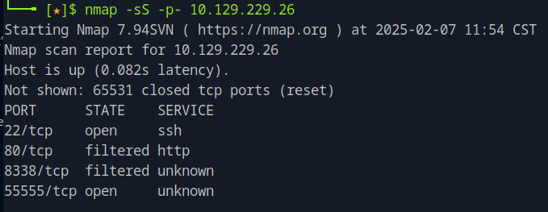
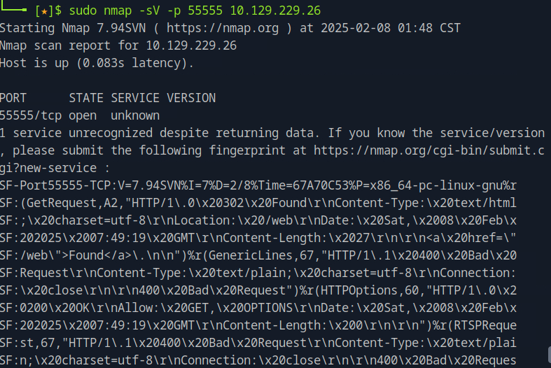
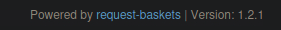
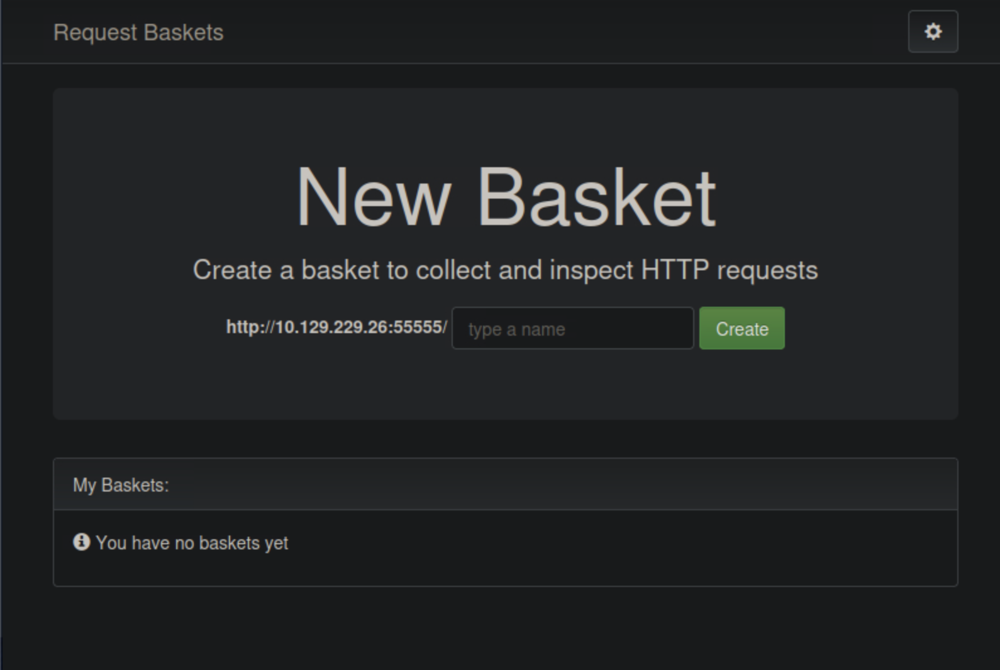
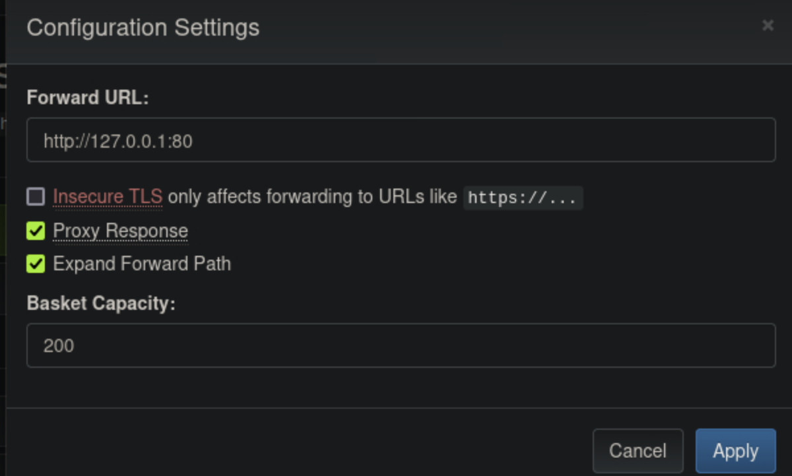
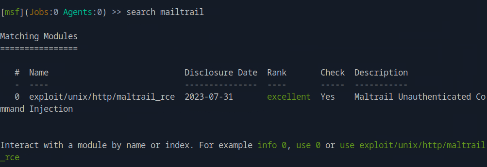
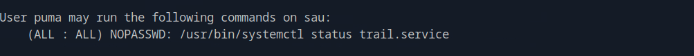

### Task 1

Which is the highest open TCP port on the target machine?

We can use nmap to scan ports in the target machine. 

```nmap -sS -p- <target_ip>```



### Task 2

What is the name of the open source software that the application on 55555 is "powered by"?

To find information about the software, we can run nmap again with the additional field **-sV**. 

```nmap -sV -p <target_port> <target_ip>```

From the result we see that the service is identified as uknown. Even so, we can infer from the fingerprint that is returned that the service is HTTP-based since it responds with HTTP headers. Part of the response is illustrated bellow:



We can then navigate to the ip address on the browser and at the bottom of the page we can find the open source software the application is powered by.



### Task 3

What is the version of request-baskets running on Sau?

From the previous task we also see the version of the open source software. 

### Task 4 

What is the 2023 CVE ID for a Server-Side Request Forgery (SSRF) in this version of request-baskets?

By a quick search on cve.org we can find the CVE ID of this vulnerability. https://www.cve.org/CVERecord?id=CVE-2023-27163

### Task 5

What is the name of the software that the application running on port 80 is "powered by"?

From the previous task, we suspect that we can find the software from exploiting the SSRF vulnerability. Server-Side Request Forgery (SSRF) is a vulnerability where an attacker can manipulate a web application into sending unauthorized requests from the server. This vulnerability often occurs when an application makes HTTP requests to other servers based on user input which is exactly what we have in hand when we access the target ip in the browser.



Using the vulnerable application, we can exploit the SSRF vulnerability by creating a basket that forwards requests to http://localhost:80 gaining access to the web server that runs the application we are looking for.

We can do that by adding the endpoint. We got the token for the basket created. 

Then we can configure the basket to forward requests to an internal service. We open the basket, and on the configuration settings we set the forward url to be our local host on port 80.



Then, if we navigate to the endpoint we made on the browser, it would redirect us to the service running on port 80.

There, on the bottom we see the name of the software.


### Task 6 

There is an unauthenticated command injection vulnerability in MailTrail v0.53. What is the relative path on the webserver targeted by this exploit?

By searching for the vulnerability we find that it exists in the login page. The relative path is ``\login``.

### Task 7

What system user is the Mailtrack application running as on Sau?

We launch Metasploit by running ``msfconsole`` and search ``search mailtrail`` to see if the metasploit framework has any exploits available for the vulnerability. 



We can see that the only exploit listed is for the vulnerability we are targeting. 

We can use the exploit by ``use 0``
and see the options that need to be configured by ``show options``

We set RHOSTS, RPORT to the target IP and port and the TARGETURI to the targeted configured endpoint. We also set the LHOST to our host machine, the LPORT is the listen port and is by default 4444.

Then we run the exploit by ``run``. And we are in. We run ``shell`` to span a shell and ``whoami`` to see the system user.

### Task 8

Submit the flag located in the puma user's home directory.

We navigate to the puma user's home directory and we list the contents to find and print by ``cat user.txt`` the flag.

### Task 9

What is the full path to the binary (without arguments) the puma user can run as root on Sau?

We can run ``sudo -l`` 



We then see the full path ``/usr/bin/systemctl``

### Task 10

What is the full version string for the instance of systemd installed on Sau?

We run ``/usr/bin/systemctl --version`` and see the version.

``systemd 245 (245.4-4ubuntu3.22)``

### Task 11

What is the 2023 CVE ID for a local privilege escalation vulnerability in this version of systemd?

Looking for the CVE ID online we find ``CVE-2023-26604``

### Task 12

Submit the flag located in the root user's home directory.

We first update the shell by running ``python3 -c 'import pty; pty.spawn("/bin/bash")'``

Then we run ``sudo /usr/bin/systemctl status cron.service``

and ``!/bin/bash`` to get a shell as root. Then we navigate to the root direcotry and get the flag.


